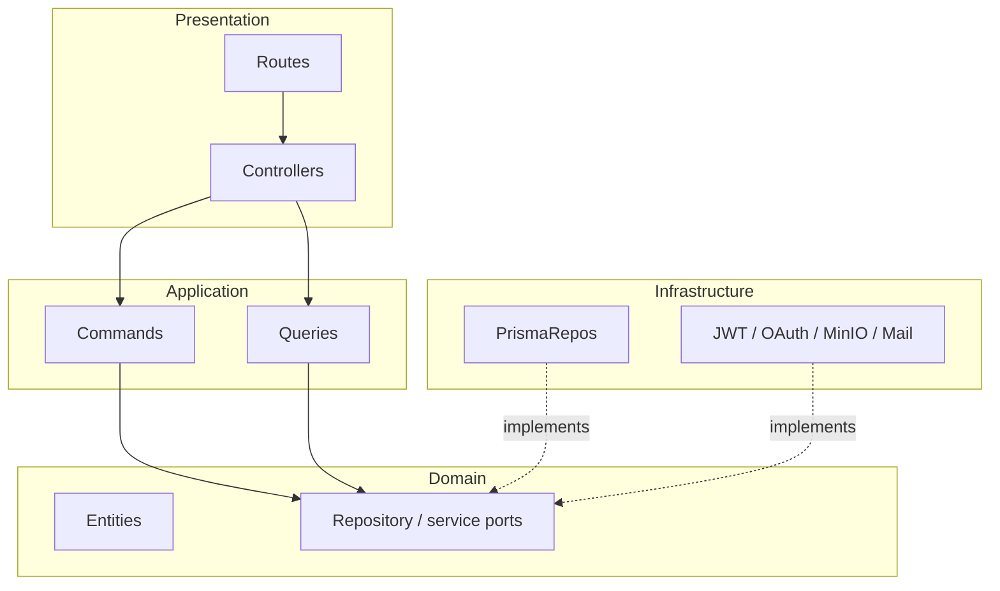
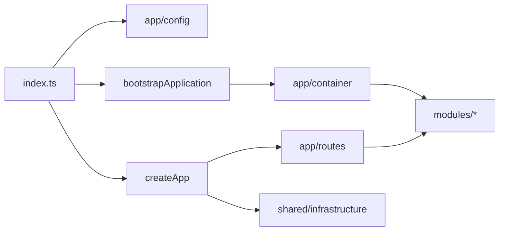

# Architecture Overview

Backend Init is an **open-source Express + TypeScript modular monolith**: one
deployable process, clear bounded contexts, and dependency rules that keep
domains replaceable.

It is intentionally not a microservice mesh. Modules share a process, a Prisma
schema, Redis, and object storage — but they communicate through **ports**
(interfaces) rather than reaching into each other’s infrastructure.

## Why a modular monolith

| Goal              | How this template approaches it                               |
| ----------------- | ------------------------------------------------------------- |
| Fast delivery     | One repo, one Docker Compose stack, one CI pipeline           |
| Clear ownership   | Each feature lives under `src/modules/<name>/`                |
| Testability       | Manual DI container; swap adapters with fakes in Vitest       |
| Future extraction | A module’s `createXxxModule` factory can move with the module |
| Low ceremony      | No DI framework, no event bus required to start               |

See [ADR 001](./decisions/001-modular-monolith.md).

## Layer model

Every domain module follows the same inward dependency direction:

```
Presentation  →  Application  →  Domain
                      ↑
               Infrastructure
```

| Layer              | Responsibility | Typical contents                                         |
| ------------------ | -------------- | -------------------------------------------------------- |
| **Presentation**   | HTTP boundary  | Controllers, routes, validators, serializers             |
| **Application**    | Use cases      | Commands, queries, DTOs, application ports               |
| **Domain**         | Business rules | Entities, value objects, repository ports, domain errors |
| **Infrastructure** | Adapters       | Prisma repositories, JWT, OAuth providers, uploaders     |

**Domain must not import Express, Prisma, Redis, MinIO, or BullMQ.**
Infrastructure implements domain ports; presentation calls application use cases
only.



ASCII equivalent:

```
  HTTP ──► presentation ──► application ──► domain ports
                                              ▲
                     infrastructure adapters ─┘
```

## Top-level source map

```
src/
├── app/                 # Composition root (HTTP process)
│   ├── config/          # Typed env — never process.env elsewhere
│   ├── container/       # Manual DI wiring for modules
│   ├── middleware/      # Cross-cutting Express middleware
│   ├── routes/          # Mounts module routers under /api/v1
│   └── app.ts           # Express factory + explicit bootstrapApplication
├── modules/             # Bounded contexts (auth, users, blog, …)
├── shared/              # Cross-module infrastructure & utils
│   ├── constants/
│   ├── domain/          # AppError and shared domain primitives
│   ├── infrastructure/  # Prisma, Redis, mail, queue, storage, logging, metrics
│   └── utils/
├── index.ts             # Process entry
└── server.ts            # Express app export (listen lives in index.ts)
```

### `src/app` — composition root

Not business logic. Owns:

- Configuration aggregation (`config`)
- Container construction (`createContainer` / `getContainer`)
- Route mounting (`registerRoutes`)
- Shared middleware under `src/app/middleware`

### `src/modules` — bounded contexts

Each module exports a factory such as `createAuthModule` /
`createDefaultAuthDeps` and usually a router. See
[modules catalog](./modules.md).

### `src/shared` — cross-cutting only

Put code here only when **two or more modules** need the same primitive (logger,
Prisma client, mail queue, storage facade, HTTP response helpers).
Domain-specific code does not belong in `shared/`.

## Runtime composition

`src/server.ts` exports `createApp()` for tests (no listen, no workers).
`src/index.ts` is the process entry: bootstrap, then listen unless
`PROCESS_ROLE=worker`.

At boot (`index.ts`):

1. Load and validate env via `@/app/config`.
2. `bootstrapApplication()` (skipped in `NODE_ENV=test`):
   - `validateRuntimeConfig()` (JWT PEMs, cookie TTL, production operator auth)
   - RBAC seed, bucket ensure, SMTP verify (throws in production on SMTP fail)
   - `startWorkers()` + `registerRepeatableJobs()` unless `PROCESS_ROLE=api`
3. If `PROCESS_ROLE=worker`, stay in-process with no HTTP listen.
4. Otherwise `createApp()`: Swagger, Bull Board, middleware, module routers.
5. `app.listen`, then SIGTERM/SIGINT drain via `gracefulShutdown`.



## API surface (high level)

Base prefix: `/api/v1` (configurable).

| Mount                                      | Module                               |
| ------------------------------------------ | ------------------------------------ |
| `/auth`                                    | auth                                 |
| `/auth/oauth`                              | oauth                                |
| `/users`                                   | users                                |
| `/blogs`                                   | blog                                 |
| `/files`                                   | files                                |
| `/admin/audit`                             | system (list / export / `{auditId}`) |
| `/health`, `/health/live`, `/health/ready` | system                               |
| `/metrics`, `/csrf-token`, CSP report      | system                               |

Backup, notifications, and rbac are primarily **library modules** (ports and use
cases). RBAC is used by auth/users; files also power avatar multipart on
auth/users; backup and mail run through BullMQ workers. Process role:
[production.md](../deployment/production.md).

## Related reading

- [Platform kernel](./platform-kernel.md)
- [Dependency rules](./dependency-rules.md)
- [Extending](./extending.md)
- [Configuration](./configuration.md)
- [ADRs](./decisions/README.md)
